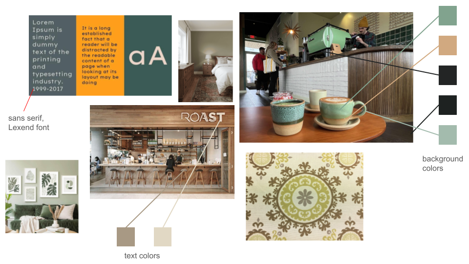
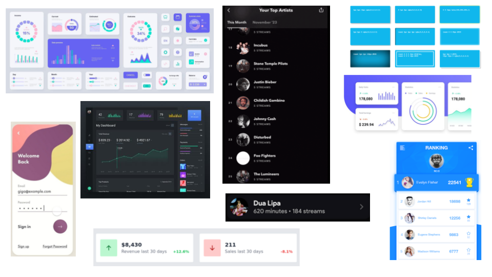

# Deliverables

## Visual Design Study

## User Journey

Upon accessing ListenBuddy, users are greeted with a welcome screen that prompts them to register or sign in. Once authenticated, users that haven't yet associated their listenBrainzToken to their account are prompted to do so. For users that have already associated their listenBrainzToken, they see the home screen, which greets users with a '{listen brainz username}'s ListenBrainz Stats' heading. In this page, they'll be able to select between the time periods of 'All Time', 'This Year', 'This Month', and 'This Week'. For the time period selected, users will be able to see the total listen hours, the average daily listen count, as well as a bar chart illustrating their listening habits throughout the week. Below, users will see a listing where they'll be able to pick if they want to see their top artists, songs, or albums. Upon clicking any of these items, a pop up opens that gives users recommendations for that item, also allowing users to give feedback on the recommendations to inform future recommendations.

Users can also press 'My Recommendations' to see the summary of recommendations they previously gave feedback on, as well as having the ability to delete any of these.
